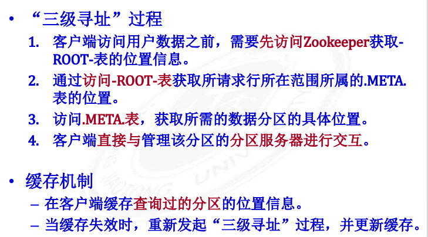
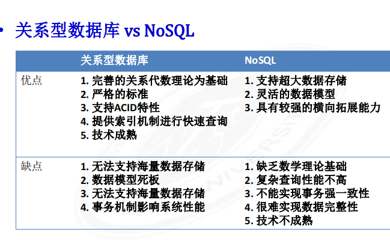
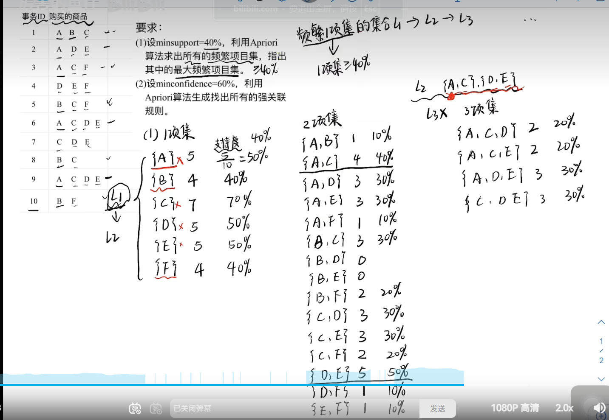
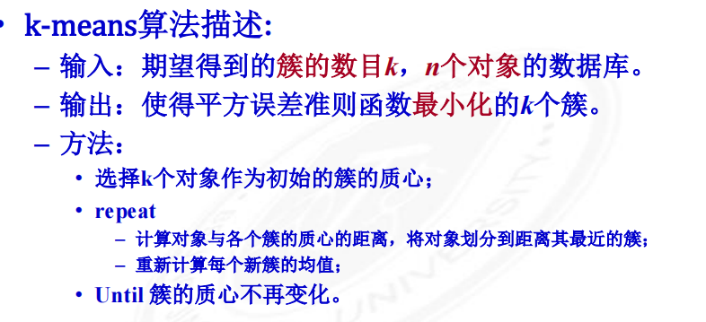
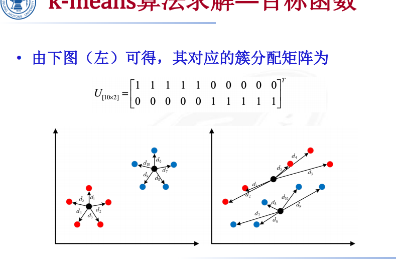

1019817244

总结

hdbase hdfs

第六章：mapreduce 

最后两张应该1-2个答题，

第五章出两道计算

# 1绪论：

**什么是数据？**

– **数据是所有能输入到计算机并被计算机程序处理的符号的总称**

• **人们通过观察现实世界中的自然现象、人类活动，都可以形成数据**

分类： 结构化，半结构化，非结构化

作用：解释现象，发现规律，从而进行预测。

大数据的定义：**大数据指的是那些增长很快，以至于难以用传统**

**（数据库）软件工具捕获、存储、管理、共享、**

**分析和可视化的数据集。**

4v特征：

  规模巨大（Volume）、

种类繁多（Variety）、

增长速度快（Velocity）和

变化频繁（Variability）的特征，

5v:增加value（数据价值）

大数据改变传统的思维方式

总体到抽样

**采样** **vs** **全样**

• **精确** **vs** **非精确**

• **因果** **vs** **关联**

• **个体** **vs** **群体**

• **随机** **vs** **规律**

转变1:从抽样到全样

转变2:从精确到非精确

转变3:从因果到关联

大数据的作用和意义：

从经济，社会，科学。去检索一下

大数据计算：

规模化

蛮算变巧算

**数据科学对学科发展的影响**

• **对数学、统计学**

– **数据科学在数学和实际应用间建立一个直接的桥梁**

– **拓展统计学研究范围**

• **对计算机科学**

– **复杂性理论拓展**

– **大数据数据管理与实时处理，对探索高效的大规模分布式数据存储、**

**查询与处理带来了需求和挑战**

– **以机器学习特别是深度学习为代表的数据分析技术在应对规模化数**

**据集的训练和检验，已经催生了软硬件一体的跨层设计和面向数据**

**处理的高性能、低功耗定制芯片、定制服务器设计**

– **此外，数据科学与其他基础和应用学科的交叉，将使数据在计算机**

**科学中的地位进一步加强**

大数据安全，数据孤岛，打通数据孤岛，好处:信息多和坏处，隐私暴露

# 2基本概念

杰姆·格雷（Jim Gray）提出著名的“新摩尔定律”，即人类有史以来的数据总量，每过18个月就会翻一番

## 大数据来源

**来自“大人群”泛互联网数据**

**来自大量传感器的机器数据**

**科学研究及行业多结构专业数据** 

**少量企业应用产生的数据**

• **如关系型数据库中的数据和数据仓库中的数据等。**

– **大量人产生的数据**

• **如推特、微博、通信软件、移动通信数据、电子商务**

**在线交易日志数据、企业应用的相关评论数据等。**

– **巨量机器产生的数据**

• **如应用服务器日志、各类传感器数据、图像和视频监**

**控数据、二维码和条形码（条码）扫描数据等**

**按数据存储的形式划分**

• **结构化数据简单来说就是数据库，如企业ERP、财务**

**系统、医疗HIS数据库、教育一卡通、政府行政审**

**批、其他核心数据库等数据。**

• **非结构化数据包括所有格式的办公文档、文本、图**

**片、XML、HTML、各类报表、图像和音频、视频信**

**息等数据**

## 大数据特征

**大数据的3S**

Size：数据的大小

• Speed：数据的处理速度

• Structure：数据的结构化

大数据表现形态

多种多样

多源性

实时性

不确定性

# 3大数据感知与获取（时间戳之类的去探讨）

大数据感知能：

辅助决策，产生价值

## 大数据获取

重点：提问方式：

**内部数据资源整合，内部数据共享的优势，意义？？**

**对数据进行有效的整合将成为是否能够对内部**

**数据进行有效利用和关键，ETL是其中重要的处理手段：**

**ETL(Extract-Transform-Load)**

**是数据的抽取、转换、装载的过程，**

**负责完成数据从数据源向目标数据**

**仓库的转化。即用户从数据源抽取**

**所需的数据，经过数据清洗，按照**

**预先定义的数据仓库模型，最终将**

**数据加载入数据仓库。**

数据抽取： 从数据库中抽取

全量和增量抽取，

增量抽取只抽取自上次抽取以来数据库中新增或修改的数据。

优秀的捕获方法应该做到能够将数据库中的变化数据以较高的准确

率获得的同时不对业务系统造成太大的压力而影响现有业务。

kettle:非实时

不准确、不完整、不合理的数据在数据质量方面各有其特点，以下是对它们区别和成因的详细分析：

一、不准确数据的区别和成因

**区别**：不准确数据指的是数据值与其实际值之间存在偏差或错误，导致数据无法正确反映实际情况。

**成因**：

1. 技术方面：数据模型设计的质量问题，如数据库表结构、数据库约束条件、数据校验规则的设计开发不合理，造成数据录入无法校验或校验不当。数据源存在数据质量问题，如从生产系统采集的数据本身存在错误。数据采集、传输、装载等过程中也可能出现技术错误，导致数据不准确。
2. 业务方面：业务需求不清晰或变更频繁，导致技术无法构建出合理、正确的数据模型。业务端数据输入不规范，如大小写、全半角、特殊字符等输入错误。人为录入的数据质量与录数据的业务人员密切相关，录数据的人工作不严谨、不认真，数据质量就相对较差。此外，数据作假也是导致数据不准确的一个重要原因。
3. 管理方面：管理层的认知问题或对数据质量的重视程度不够，也可能导致数据不准确。

二、不完整数据的区别和成因

**区别**：不完整数据指的是数据集中缺少某些必要的属性或记录，导致数据无法全面反映实际情况。

**成因**：

1. 数据源本身可能就不完整，如某些属性或记录在生产系统中就没有被记录。
2. 数据采集过程中可能由于采集点、采集频率、采集内容等设置不正确，导致某些数据没有被采集到。
3. 数据传输或装载过程中可能出现错误，导致部分数据丢失。
4. 业务需求或规则变更可能导致某些原本认为不必要的属性或记录被删除，从而造成数据不完整。

三、不合理数据的区别和成因

**区别**：不合理数据指的是数据值虽然准确且完整，但不符合业务规则或常识，导致数据无法被正确理解和使用。

**成因**：

1. 业务需求或规则不清晰，导致技术无法构建出符合业务规则的数据模型。
2. 数据输入时，由于业务人员对数据规则的理解不准确或操作失误，导致输入了不合理的数据。
3. 数据处理过程中可能出现逻辑错误或算法错误，导致数据被错误地转换或计算，从而产生不合理的数据。

综上所述，不准确、不完整、不合理的数据在数据质量方面各有其特点，成因也各不相同。为了提高数据质量，需要从技术、业务、管理等多个方面入手，确保数据的准确性、完整性和合理性。

互联网数据

**多源异构性：**网络大数据通常由不同的用户、不同

的网站产生，数据形式也呈现出不同的形式，如语音、

视频、图片和文本。

**交互性：**不同于测量和传感器获取的大规模科学数

据（如气象数据、卫星遥感数据），微博、微信、

Facebook、Twitter等社交网络兴起导致大量网络数据

具有较强的交互性。

**时效性：**在互联网和移动互联网平台上，每时每刻

都有大量的新数据发布，网络大数据内容不断变化，使

得信息传播具有时序相关性。

**社会性：**网络上用户不仅可以根据需要发布信息，

也可以根据自己的喜好回复或转发信息，网络大数据直

接反映了社会状态。

**突发性：**有些信息在传播过程中会在短时间内引起

大量新的网络数据的产生，并使相关的网络用户形成网

络群体，体现出网络大数据以及网络群体的突发特性。

**高噪音：**网络大数据来自于众多不同的网络用户，

具有很高的噪声和不确定性。

网络爬虫是一种自动搜集互联网信息的程序，它为搜索引擎从万维网上下载网页，是搜索引擎的重要组成

/urls网页地址/

# 4大数据存储与管理：

## 分布式分拣系统’

Hadoop是由Apache基金会开发的分布式系统基础架构。

• Hadoop的特点– 存储和高速运算。– 核心设计：HDFS和MapReduce，HDFS (Hadoop Distributed File System) 为海量数据提供存储，MapReduce为海量数据提供计算。

HDFS作为Hadoop的分布式文件系统，其功能为数据的存储、管理和出错处理。设计的目的是用于可靠地存储大规模的数据集，并提高用户访问数据的效率。

适合大文件存储和处理
集群规模可动态扩展
能有效保证数据一致性
数据的吞吐量大跨平台移植性好

一个数据块的多个读本会被分到不同的数据节点上

加快数据传输速度

容易检查数据错误

保证数据可靠性

数据错误与恢复
(1)名节点出错
名节点保存了所有的元数据信息，其中，最核心的两大数据结构是FsImage和Editlog，若这两个文件发生损坏，那么整个HDFS实例将失效。
将核心文件同步复制到备份服务器SecondaryNameNode上当名节点出错时，可根据备份服务器SecondaryNameNode中的FsImage和Editlog数据进行恢复。

(2)数据节点出错
每个数据节点会定期向名节点发送“心跳”信息，向名节点报告自己的状态。
当数据节点发生故障，或者网络发生断网时，名节点就无法收到来自数据节点的心跳信息，这时，这些数据节点就会被标记为“**宕机”**，节点上面的所有数据都会被标记为“不可读”，名节点不会再给它们发送任何I/0请求。
名节点会定期检查，一旦发现某个数据块的副本数量小于冗余因子，就会启动数据冗余复制，为它生成新的副本。

数据出错(3)
网络传输和磁盘错误
在文件被创建时，客户端就会对每一个文件块进行信息摘录，并把这些信息写入到同一个路径的隐藏文件里面客户端读取文件时，会先读取信息文件，然后，利用该信息文件对每个读取的数据块进行校验，如果校验出错客户端就会请求到另外一个数据节点读取该文件块，并且向名节点报告这个文件块有错误，名节点会定期检查并且重新复制这个块。

原理总结：

名节点与数据节点
从HDFS系统的内部架构来看，一个文件被分成多个文、件块储存在数据节点集上。

文件系统命名空间

HDFS支持传统的层级文件组织结构，任何有关文件系统的改变都会被记录。

数据复制
HDFS将文件分成大小相同的若干份存储于各个数据节点，同时在其它若干数据节点上也保存各个文件块的副本。

文件系统元数据持久存储
HDFS文件系统的元数据信息存储在名节点上，名节点将持久记录文件系统上的变化。

多副本的流式复制将名节点上存储副本的节点信息循环写入数据节点。

心跳检测和重新复制数据节点定期向名节点报告状态，

## 分布式数据库

都建议看ppt吧

## 非关系型数据库

NoSQL三大基石理论-CAP理论-BASE理论-最终一致性

**一个分布式系统不可能同时满足****CAP****三个需求，**

**最多只能****同时满足其中两个**

nosql

可扩展性
灵活的数据模型
与云计算紧密结合

# 5大数据挖掘与分析

jaccard 系数

用于计算符号度量或布尔值度量的个体间的相似度

若个体的特征属性是由符号度量或者布尔值标识:只可得到“是否相同”的结果，无法衡量差异具体值的大小。Jaccard系数可衡量个体间共同具有的特征是否一致。
若比较 x与 Y 的Jaccard系数，只需比较 名和 中相同的个数，公式如下:
Jaccard(X,Y)=XUr

**特征表示**，是将数据转换为有利于后续分析和处理的形式而进行的一种形式化表示和描述。

-不同类型数据使用不同特征表示方法特征表示有利于后续的分析处理
模型输出为可计算向量
借鉴专家知识，能够提高特征表示质量对原始数据数字化后的特征表示可以描述原始对象

## aprior（看一下

关联规则反映事物之间的相互依存性和关联性。若两个或者多个事物之间存在一定的关联关系，则其中一个事物能够从其它事物中推断出来。

关联规则反映事物之间的相互依存性和关联性。若两个或者多个事物之间存在一定的关联关系，则其中一个事物能够从其它事物中推断出来。

性质1 频繁项集的子集必为频繁项集。
性质2 非频繁项集的超集一定是非频繁的。

所以候选3只能是一个，即存在{cola,diaper},{cola ,beer}{diaper,beer}

频繁项目集有L1和L2,最大频繁项目集有B,F,{a,c},{d,e},

首先L1中的去掉在L2中出现过的，就剩B,F，然后L3不存在所以都是最大频繁项目集

从L2中去找，只有A->C,D>E,E->D具有强关联规则

当有三个的话，即L3，就是两个推一个P（ACD）/P（AC）

## k-means

## 回归

重要

## accu(考前看)

## knn（考虑k个数）

Lp距离是一种度量两个点之间距离的方法，具体定义如下：

1. **Lp距离的定义**：Lp距离是由第p次方的各维坐标的差的绝对值的和的第p次根得到的。Lp距离是一种Lp范数，其中p为正实数。

2. 特殊情况的Lp距离

   ：

   - 当p=1时，称为曼哈顿距离（Manhattan distance）。在二维平面上，曼哈顿距离的计算公式为d=|x1-x2|+|y1-y2|。例如，在曼哈顿街区乘坐出租车从P点到Q点，白色表示高楼大厦，灰色表示街道，那么红线、蓝线、黄线的行驶距离都是一样的，都是曼哈顿距离。
   - 当p=2时，称为欧几里得距离（Euclidean distance），也称为欧氏距离。在二维平面上，欧氏距离的计算公式为d=((x1-x2)^2+(y1-y2)^2)^(1/2)，即两点间的直线距离。
   - 当p为无穷大时，称为切比雪夫距离（Chebyshev distance）。在二维平面上，切比雪夫距离的计算公式为d=max(|x1-x2|, |y1-y2|)。这可以类比于国际象棋中国王从格子(x1,y1)走到格子(x2,y2)的最少步数。

3. **Lp距离的应用**：Lp距离在机器学习和数据挖掘等领域中有着广泛的应用。例如，在K近邻（KNN）算法中，Lp距离可以用于计算特征空间中两个实例点之间的距离，从而评估它们的相似程度。

总的来说，Lp距离是一种灵活且强大的工具，可以根据不同的p值来适应不同的应用场景和需求。

## 朴素贝叶斯（看计算）

比较两个概率的大小，谁正是哪一类

## RNN和LSTM（应该不考

LSTM实现长期记忆，在考虑最近时刻的状态的同时允许模型获取之前的长期状态。

RNN与传统神经网络的不同之处在于其允许对向量的序列进行操作，输入输出都可为序列形式。
由于一个序列当前的输出与前面的输出也有关RNN需要有记忆特性，具体表现为RNN会对前面的信息进行记忆并应用于当前输出的计算中，即隐藏层之间的节点不再是无连接的而是有连接的并且隐藏层的输入不仅包括输入层的输出还包括上一时刻隐藏层的输出。

LSTM--遗忘门(forget gate)遗忘门用于判断细胞状态中应当丢弃的信息。
f=o(Wrht-1+ Ufxt+ br)f 中每个值的范围为[0,1]，值越接近1表明细胞状态 c-中对应位置的值应该被记住，值越接近0表明对应位置的值更应该被遗忘。

LSTM--输入门(input gate)输入门用于判断应加入细胞状态中的信息。-
it=o(Wiht-1+ Uixt+ bi)候选的细胞状态 提供更新的输入信息。Ct=tanh(Wcht-1+ Ucxt+ bc)

LSTM--细胞状态更新(input gate)利用遗忘门和输入门可更新得到t时刻的细胞状态，

## GAN

生成对抗网络(GAN)
生成器 G 作为一个生成图片的网络,接收一个随机的噪声z,利用该噪声生成图片,记作G(z)。判别器 D作为一个判别网络,判别一张图片是否“真实”。输入参数为 x，x代表一张图片,输出D(x)代表x为真实图片的概率。若D(x)为1,表示100%是真实的图片,输出为0则代表其不是真实图片在训练过程中,

G的目标是尽量生成真实的图片去欺骗D，而D的目标是尽量把G生成的图片和真实的图片区分开。G和D构成了一个动态的“博弈过程’’

其中,G代表生成器，D代表判别器,训练时分别对D和G进行交互迭代,固定G,优化D, 一段时间后,固定D再优化G,直到模型收敛。

## 可视化

观测跟踪数据，分析数据，辅助理解数据，增强数据吸引力

# 6架构与处理

## 集中式分布：

大型主机，超级计算机

特点：RAS(Reliability,Availability,Serviceability;高可靠性、高可用性、高服务性)

优势

问题：

相比通用计算机：

计算性能更高，性能以每秒执行的浮点运算次数衡量。

用于计算密集型任务

## 分布式计算架构：

个人认为spark不考，准备Mapreduce就行

直接看ppt吧

6.2都要看

百度的硅谷人工智能实验室（SVAIL）已经为深度学习硬件提出了**DeepBench**基准，这一基准着重衡量的是基本计算的硬件性能。

• 现在的深度学习算法主要包括卷积神经网络（CNN）和循环神经网络（RNN）。

基于深度学习算法，DeepBench提出以下四种基本运算：

– 矩阵相乘（Matrix Multiplication）——几乎所有的深度学习模型都包含这一运算，它的计算十分密集。

– 卷积（Convolution）——另一个常用的运算，占用了模型中大部分的每秒浮点运算（浮点／秒）。

– 循环层（Recurrent Layers）——模型中的反馈层，并且基本上是前两个运算的组合。

– All Reduce——一个在优化前对学习到的参数进行传递或解析的运算序列。在跨硬件分布的深度学习网络上执行同步优化时（如AlphaGo），这一操作尤其有效。

**图形处理器**

GPU

GPU加速计算是指同时利用图形处理器(GPU)和CPU，加快科学分析、工程、消费和企业应用程序的运行速度

理解GPU和CPU之间区别的一种简单方式是比较它们如何处理任务。

• CPU由专为顺序串行处理而优化的几个核心组成，而GPU则拥有一个由数以千计的更小、更高效的核心(专为同时处理多重任务而设计)组成的大规模并行计算架构。

TPU

**张量处理器**

是为机器学习定制的专用芯片，专为深度学习框架 Tensorflow而设计。

与图形处理器(GPU)相比，TPU采用低精度(8位)计算，以降低每步操作使用的晶体管数量。降低精度对深度学习准确度影响很小，但却可以大幅降低功耗、加快运算速度。同时，TPU使用了脉动阵列的设计，用来优化矩阵乘法与卷积运算，减少I/O操作。此外，TPU还采用了更大的片上内存，以此减少对DRAM的访问，从而更大程度地提升了性能

CPU/GPU的结构特性对平均吞吐更有效，而TPU针对响应延迟设计

fpga

现场可编程逻辑闸阵列( field programmable gate array, FPGA) 是在PAL、GAL、CPLD等可编程逻辑器件的基础上进一步发展的产物。• 它是作为专用集成电路领域中的一种半定制电路而出现的，既解决了定制电路的不足，又克服了原有可编程器件门电路数有限的缺点。

• 目前以硬件描述语言( Verilog或VHDL)描述的逻辑电路，可以利用逻辑综合和布局、布线工具软件，快速地烧录至FPGA上进行测试，这一过程是现代集成电路设计验证的技术主流。

• FPGA一般来说比专用集成电路的速度要慢，无法完成更复杂的设计，并且会消耗更多的电能。• 但FPGA具有很多优点，比如可以快速成品，而且其内部逻辑可以被设计者反复修改，从而改正程序中的错误，此外，使用FPGA进行除错的成本较低

从数据吞吐能力上看，新一代FPGA的数据处理加速能力理论上已经可以与GPU比肩。同吋，由于半导体工艺的不断进步，FPGA器件的功率也控制得很好。CPU+FPGA这种异构处理器组合被越来越多的人所看好