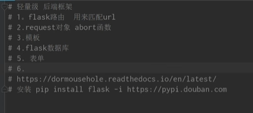

加分项：

调用api，实现连续追踪，而不是实际的瞬移过程

视频，图像匹配

导航：基本的算法

民宿，图书馆预约，商家附近指示

需求分析

痛点，服务优势

### 开题答辩：

甘特图：分工

多线程。主线程

relativelauout

没有的wifi信号用-256

listview：数据源换入到模版是有难度的

4：原型设计（墨刀），去绘制图

10：部署在手机上是什么样的

15：路线规划，算法应用

余弦的使用是大于欧式距离的

# 安卓开发学习

## 预备

### 快捷键

在 Android Studio 中，追踪代码进入的方法（即导航到代码定义或实现）有几个常用的快捷键。以下是一些常用的快捷键：

### 跳转到定义
- **Windows/Linux**：`Ctrl + B` 或 `Ctrl + 左键单击`
- **Mac**：`Command + B` 或 `Command + 左键单击`

### 跳转到声明
- **Windows/Linux**：`Ctrl + Shift + B`
- **Mac**：`Command + Option + B`

### 查找用法
- **Windows/Linux**：`Alt + F7` 或 `Ctrl + Shift + F7`
- **Mac**：`Option + F7` 或 `Command + Option + F7`

### 跳转到实现
- **Windows/Linux**：`Ctrl + Alt + B`
- **Mac**：`Command + Option + B`

### 进入/退出代码（步进/步出，调试时使用）
- **步入 (Step Into)**：
  - **Windows/Linux**：`F7`
  - **Mac**：`F7`
- **步过 (Step Over)**：
  - **Windows/Linux**：`F8`
  - **Mac**：`F8`
- **步出 (Step Out)**：
  - **Windows/Linux**：`Shift + F8`
  - **Mac**：`Shift + F8`

### 查找符号
- **Windows/Linux**：`Ctrl + Alt + Shift + N`
- **Mac**：`Command + Option + O`

### 查找类
- **Windows/Linux**：`Ctrl + N`
- **Mac**：`Command + O`

### 查找文件
- **Windows/Linux**：`Ctrl + Shift + N`
- **Mac**：`Command + Shift + O`

通过这些快捷键，您可以在 Android Studio 中快速导航和追踪代码的定义、声明和使用，极大提高开发效率。如果这些快捷键与您的操作系统或 Android Studio 的版本不同，您可以在 Android Studio 的设置中查看和自定义快捷键。

### 连接到手机

https://blog.csdn.net/weixin_44047784/article/details/121944846?ops_request_misc=%257B%2522request%255Fid%2522%253A%2522171981899516800182188655%2522%252C%2522scm%2522%253A%252220140713.130102334.pc%255Fall.%2522%257D&request_id=171981899516800182188655&biz_id=0&utm_medium=distribute.pc_search_result.none-task-blog-2~all~first_rank_ecpm_v1~rank_v31_ecpm-2-121944846-null-null.142^v100^pc_search_result_base5&utm_term=%E5%AE%89%E5%8D%93%E5%BC%80%E5%8F%91%E8%BF%9E%E6%8E%A5%E5%88%B0%E6%89%8B%E6%9C%BA%E4%B8%8A&spm=1018.2226.3001.4187

### 切换到移动的模式

## 登录注册

最后一个activity是程序的入口

## relativelayout

# flask

