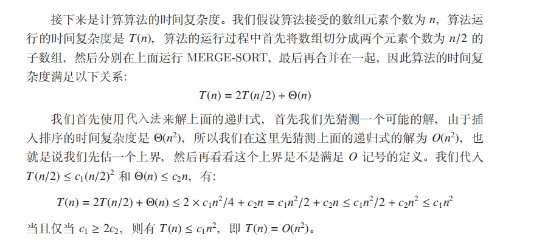
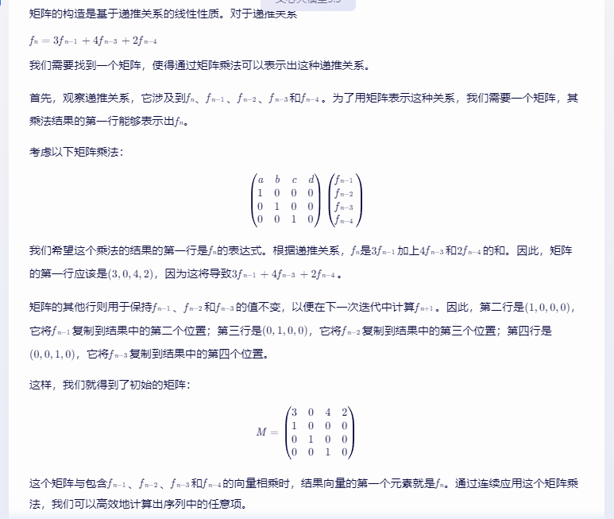
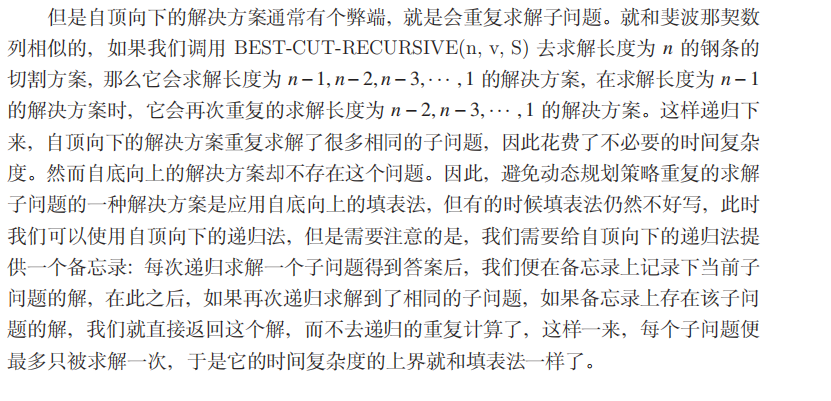
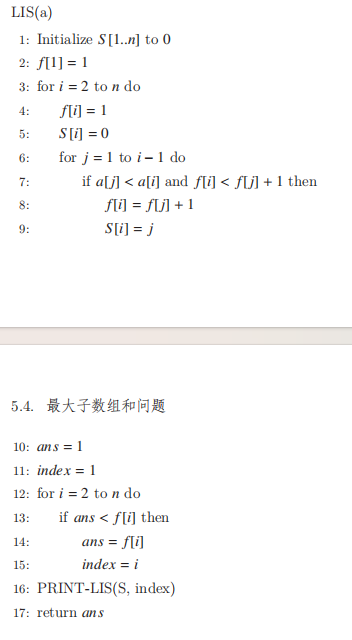
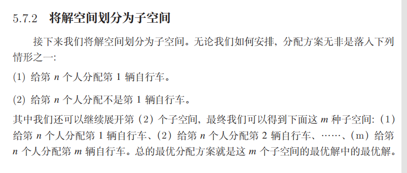

NP问题

https://blog.csdn.net/huang1024rui/article/details/49154507?ops_request_misc=%257B%2522request%255Fid%2522%253A%2522171924042816800184172518%2522%252C%2522scm%2522%253A%252220140713.130102334..%2522%257D&request_id=171924042816800184172518&biz_id=0&utm_medium=distribute.pc_search_result.none-task-blog-2~all~sobaiduend~default-2-49154507-null-null.142

 P: 能在多项式时间内解决的问题

　　NP: 不能在多项式时间内解决或不确定能不能在多项式时间内解决，但能在多项式时间验证的问题

　　NPC: NP完全问题，所有NP问题在多项式时间内都能约化(Reducibility)到它的NP问题，即解决了此NPC问题，所有NP问题也都得到解决。

​          首先，它得是一个NP问题；然后，所有的NP问题都可以约化到它。证明一个问题是 NPC问题也很简单。先证明它至少是一个NP问题，再证明其中一个已知的NPC问题能约化到它（由约化的传递性，则NPC问题定义的第二条也得以满足；至于第一个NPC问题是怎么来的，下文将介绍），这样就可以说它是NPC问题了。

　　NP hard:NP难问题，所有NP问题在多项式时间内都能约化(Reducibility)到它的问题(不一定是NP问题)。NP-Hard问题。NP-Hard问题是这样一种问题，它满足NPC问题定义的第二条但不一定要满足第一条（就是说，NP-Hard问题要比 NPC问题的范围广）

简单来说，一个问题是P问题，则其也一定是NP问题，反之一个问题是NP问题，则并不一定是P问题。一个问题是NP问题要证明其一定是P问题，也就P=NP，这还属于一个未解难题，因此通常认为P≠NP。

# 时间复杂度

代入法求上界

递归树

公式

nlglgn

算法

1. **有效性 (Effectiveness)**：
   - 一个算法是有效的，意味着它的每一个操作都可以在有限时间内完成。即每个步骤都足够基本，能够在有限时间内通过一个人类或机器来执行。
2. **有限性 (Finiteness)**：
   - 有限性指的是算法必须在有限的步骤内终止。换句话说，算法不能进入无限循环，它必须在完成任务后终止。因此，要求算法必须可以终止指的是算法的有限性。
3. **健壮性 (Robustness)**：
   - 健壮性是指算法在面对异常或意外输入时仍能有效运行的能力。一个健壮的算法应该能够处理异常情况，并且在这些情况下不会崩溃。
4. **正确性 (Correctness)**：
   - 正确性指的是算法能否正确地解决问题，即对于所有合法输入，算法能否产生正确的输出。正确性是算法设计中最重要的属性，因为一个不正确的算法无论多快或多高效，都无法达到预期的目的。
5. 最优性 (Optimality)
   - 最优性指的是算法是否能以最小的资源消耗（如时间、空间）解决问题。例如，在排序算法中，最优性可能意味着算法在最坏情况下也能达到最佳的时间复杂度。

# 分治策略：

prefix为目标，A【Mid】大

算法的正确性：理智分析叙述

归并排序

快速排序

二分查找和算法正确性

矩阵快速幂是怎么求的

f(n)=f(n-1)+f(n-2)+1

# 动态规划

两种思想：

最后一个是n,n-1

前1,2,...n个

二维数组的填表

以xx结尾

最优子结构：

猜的方法和考的：先拿一个最优的方案过来，然后对尾部（一般情况下都是）或者部分去砍掉，假定它是最优子结构，那这个最优子结构是什么问题的最优解然后结果就出来了

算法的正确性：强归纳定理

0-1背包问题：

转换为前n个物品的最优方案

填表

下：

思想是每次的拓展都在前面所有情况的基础上进行拓展

很重要的二维数组填表，注意从1开始填，f[0][0是空的

第八航错误：=f[i[j-1]

固定了A数组，每次A数组进行增加长度，求该长度的最长公共子序列

矩阵连乘问题：

# 贪心选择性质

怎么找出贪心选择性质：

给出一个正常的顺序，然后写出交换第k和第k+1后的对结果的影响的算式，依据我们贪心选择性质交换的影响是正还是负，从而求解除关系，而这个关系就是贪心选择性质，典型的下个题目。

从底往上：填表法

从上往下就是递归

判定条件为：每次进行选择之后去判定下一次选择的变量，它代表什么含义就作为贪心选择

## 时间复杂度分析

为了分析这个算法的时间复杂度，我们需要考虑递归调用的次数以及每次调用的工作量。

1. **递归树的深度**：递归调用的深度等于活动数量 𝑛*n*，因为在最坏情况下，每个活动都可以递归调用其他活动。
2. **每次递归调用的工作量**：在每次递归调用中，算法遍历所有活动，复杂度为 𝑂(𝑛)*O*(*n*)。
3. **记忆化存储**：算法使用一个记忆化数组 𝑓*f* 来存储已经计算过的子问题结果，从而避免重复计算。由于每个活动对应的状态只计算一次，因此每个活动的最大活动数量计算最多只进行一次。
4. **总体复杂度**：考虑到每次递归调用的工作量为 𝑂(𝑛)*O*(*n*)，并且最坏情况下，每个活动都递归调用 𝑛*n* 次。因此，总体时间复杂度为 𝑂(𝑛2)*O*(*n*2)。

总结来说，该算法的时间复杂度为 𝑂(𝑛2)*O*(*n*2)，这是因为每个活动在最坏情况下都会递归遍历所有其他活动一次，而由于记忆化存储的存在，确保每个子问题只被计算一次，从而限制了总的计算次数。

function MINIMUM_WAITING_TIME(times):
    sort(times)  // 将接水时间从小到大排序
    total_waiting_time = 0
    for i = 0 to n-1:
        waiting_time = 0
        for j = 0 to i-1:
            waiting_time += times[j]
        total_waiting_time += waiting_time
    return total_waiting_time

**贪心选择性：规范证明**

若当前仍需要凑的金额大于等于20元，就选取20元的货币，若当前仍需要凑的金额大于等于10元，就选取10元的货币……以此类推。

**正确性证明：**

若当前仍需要凑的金额大于等于20元，且最优方案不选择20元的货币，那么该最优方案中选择的10元货币一定不超过1张，选择的5元货币一定不超过1张，选择的1元货币一定不超过4张，否则，若选择2张及以上的10元货币，则可用2张10元换一张20元，使得总张数变小，与该方案是最优方案相矛盾。若选择2张及以上的5元货币，则可用2张5元换一张10元，使得总张数变小，与该方案是最优方案相矛盾。若选择5张及以上的1元货币，则可用5张1元换一张5元，使得总张数变小，与该方案是最优方案相矛盾。

此时，若不选择20元的货币，由于最优方案中选择的10元货币一定不超过1张，选择的5元货币一定不超过1张，选择的1元货币一定不超过4张，可知，最优方案至多只能凑出19元，与当前仍需要凑的金额大于等于20元相矛盾。

因此，若当前仍需要凑的金额大于等于20元，就一定要选取20元的货币。

以此类推，若当前仍需要凑的金额大于等于10元，就选取10元的货币……（我可以这么写，但你不可以，你需要写完整）

必须明确的写出矛盾，或者有严格的数学推导，才会被视为正确的证明。

function MINIMUM_INITIAL_ENERGY(tasks):
    // tasks 是一个包含 (ai, bi) 的列表
    sort(tasks, by=bi ascending)  // 按照开启能量 bi 升序排序
    total_energy = 0
    current_energy = 0
    

    for i = 0 to n-1:
        ai = tasks[i].ai
        bi = tasks[i].bi
        
        // 如果当前能量不足以开启任务，增加初始能量
        if current_energy < bi:
            total_energy += (bi - current_energy)
            current_energy = bi
        
        // 完成任务，消耗能量
        current_energy -= ai
    
    return total_energy

本质上就是之前的这个活动问题是一致

